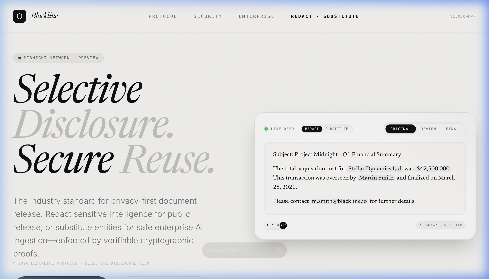
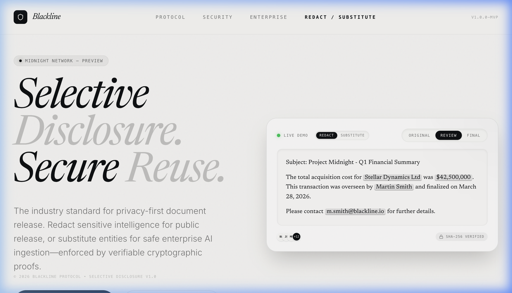
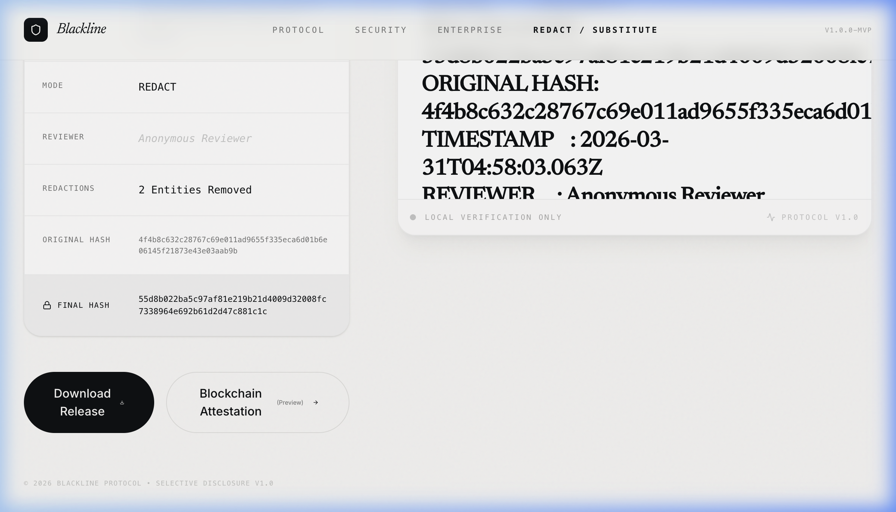

<div align="center">
  
</div>

# Blackline — Selective Disclosure Engine

**Blackline** is a privacy-first document redaction and substitution platform. It combines AI-powered entity recognition, human-in-the-loop verification, and cryptographic proofs of integrity to enable safe data sharing and AI ingestion.

Built for legal teams, compliance officers, and privacy engineers who need precise, auditable control over what gets disclosed and what stays protected.

## Screenshots

### Landing


### Review workflow


### Manifest & Proof


---

## Core Concepts

### Redact vs. Substitute
- **Redact**: Completely obscure sensitive information (e.g., "The budget is `[REDACTED]`"). Best for public release or legal discovery.
* **Substitute**: Replace sensitive entities with context-preserving placeholders (e.g., "John Doe" → `[PERSON_1]`). Best for **Enterprise AI reuse**, allowing LLMs to understand relationships and context without accessing actual PII.

### Trust but Verify
Blackline uses a **Dual-Path AI Engine** (powered by Google Gemini) where user instructions take priority over generic classification. However, because disclosure is high-stakes, the platform enforces a **Human-in-the-Loop** workflow where every AI suggestion must be approved before the final document is generated.

---

## Key Use Cases

### 1. Enterprise AI Data Ingestion
Safely feed internal documents, transcripts, and reports into LLMs. By using **Substitution**, you preserve the structural utility of the data for the AI while ensuring no sensitive customer or corporate data leaves your controlled environment.

### 2. Legal & Public Disclosure
Streamline the process of preparing documents for FOIA requests, court filings, or general public release. The **Manifest** provides an auditable trail of what was changed, by whom, and when.

---

## Features

- **Instruction-First AI** — Tell the AI *exactly* what to look for (e.g., "Hide all project names and financial figures").
- **Manual Overrides** — Select any text span in the original document to create custom redactions instantly.
- **Bulk Workflow** — Efficiently review AI suggestions with bulk accept/reject and quick keyboard shortcuts.
- **Cryptographic Manifest** — Generates a SHA-256 hash-chain manifest linking the original document, the redacted version, and the reviewer's signature.
- **Midnight Wallet Integration (Preview)** — Connect a **Midnight Lace** wallet to sign disclosure attestations, paving the way for Zero-Knowledge proofs of redaction.

---

## Tech Stack

- **Frontend**: React 19, Tailwind CSS v4, Motion (Framer Motion), Lucide Icons
- **Backend**: Express, Google Gemini AI (`@google/genai`)
- **Blockchain**: Midnight Network SDK (Preview)
- **Build**: Vite 6, TypeScript 5.8

---

## Getting Started

### Prerequisites
- Node.js v18+
- A [Gemini API key](https://aistudio.google.com/apikey)

### Setup
1. **Clone the repository**
   ```bash
   git clone https://github.com/eliasasbrede/Blackline.git
   cd Blackline
   ```

2. **Install dependencies**
   ```bash
   npm install
   ```

3. **Configure Environment**
   ```bash
   cp .env.example .env
   # Edit .env and add your GEMINI_API_KEY
   ```

4. **Launch Local Servers**
   ```bash
   npm run dev:all
   ```
   Access the app at **http://localhost:3000**.

---

## Roadmap

- [ ] **Native PDF/DOCX Support**: Direct ingestion and export of formatted documents.
- [ ] **On-Chain Persistence**: Publishing redaction manifests to the Midnight network for permanent, trustless verification.
- [ ] **Template Library**: Pre-set redaction rules for GDPR, HIPAA, and CCPA.
- [ ] **ZKP Integration**: Verified "Proof of Redaction" where a third party can verify a document was redacted according to specific rules without seeing the original data.

## Limitations (MVP)
- **Preview Integration**: The Midnight wallet integration is a functional preview. On-chain state persistence is coming in v0.4.
- **Format Support**: Current version focuses on text-based formats (`.txt`, `.md`).
- **File Size**: Optimised for documents up to 100k characters.

## License
MIT — © 2026 Blackline Protocol.
